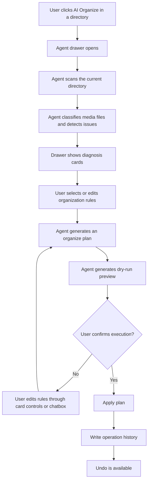
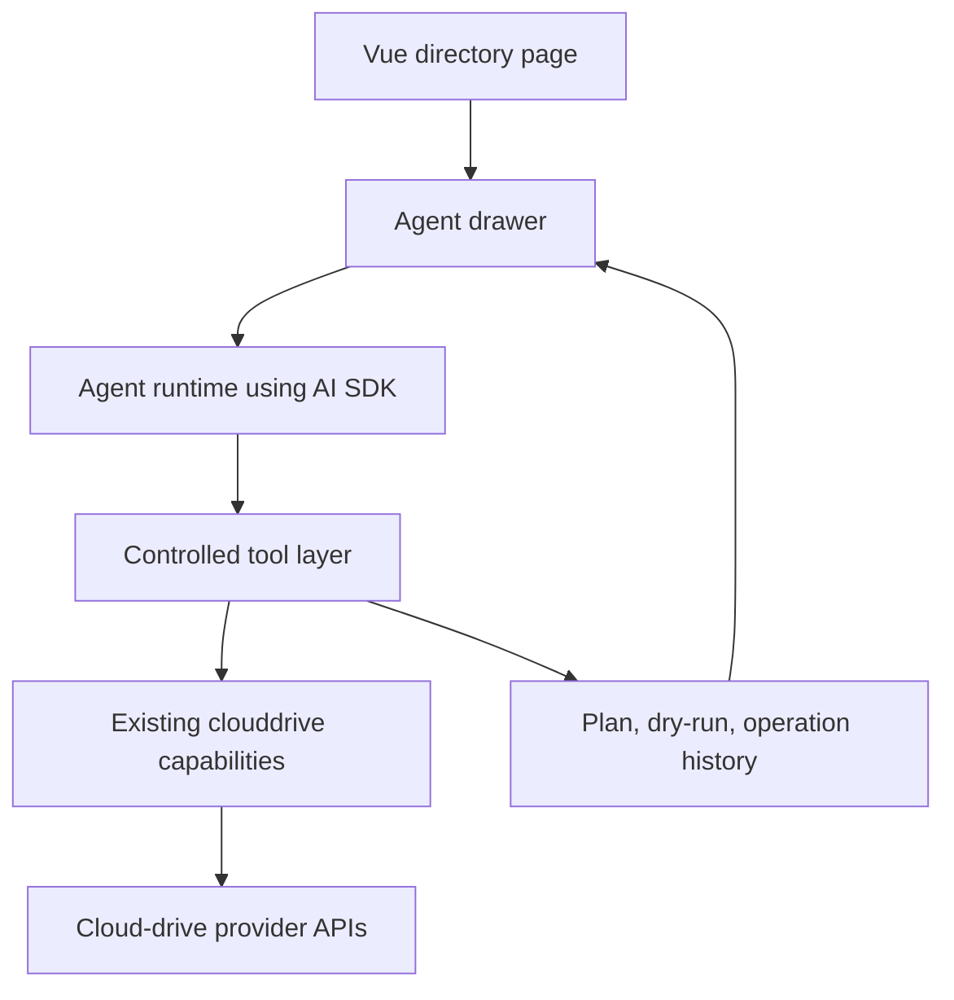

# BoxPlayer Agent Media Organizer MVP Design

## Status

Approved direction from brainstorming. This document defines the first MVP scope for integrating an AI Agent into BoxPlayer.

## Product Goal

BoxPlayer should not expose AI as a generic chat page first. The first Agent experience should help users safely organize the current cloud-drive media directory through a structured, confirmable workflow.

The MVP goal is:

> A user can click AI Organize in a cloud-drive directory, let the Agent scan and diagnose the directory, generate a dry-run organize plan, adjust the plan through a contextual chatbox, confirm execution, and undo the operation afterward.

This creates the foundation for later discovery, Bilibili following, TMDB recommendations, personalized suggestions, and library matching.

## MVP Scope

The first version includes:

- A cloud-drive directory toolbar entry: `AI Organize`.
- A right-side Agent drawer that stays attached to the current directory context.
- Structured task cards for scan results, diagnosis, rules, organize plan, and dry-run preview.
- A contextual chatbox inside the drawer for rule changes and follow-up questions.
- Current directory scanning.
- Movie, TV episode, subtitle, duplicate, and unknown-file detection.
- Naming issue diagnosis.
- Rename and move plan generation.
- Dry-run preview before every write operation.
- User confirmation before execution.
- Operation history and undo entry.

The first version does not include:

- Bilibili following.
- TMDB trending or discovery pages.
- Personalized recommendations.
- Internet-wide resource search.
- Automatic deletion.
- Background scheduled tasks.
- Fully autonomous execution without user confirmation.

These are follow-up features after the Agent drawer, tool layer, and safe execution loop are stable.

## User Experience

### Entry Points

The MVP has three restrained entry points:

1. `AI Organize` in the current cloud-drive directory toolbar.
2. `AI Diagnose This Folder` in a folder context menu or more menu.
3. The chatbox at the bottom of the Agent drawer after a task has started.

The chatbox is not the global primary entry. Users should not need to invent a prompt from a blank state.

### Agent Drawer Layout

The drawer opens from the right side and keeps the current directory visible.

It has four sections:

1. Task header:
   - Task name.
   - Current provider, account, file id, and path.
   - Permission mode, such as `Plan Mode`.

2. Status flow:
   - `Waiting`
   - `Scanning`
   - `Diagnosis Complete`
   - `Waiting For Rules`
   - `Generating Plan`
   - `Waiting For Dry-run`
   - `Waiting For Confirmation`
   - `Executing`
   - `Complete`
   - `Undo Available`
   - `Failed`

3. Structured result cards:
   - Scan result card.
   - Diagnosis card.
   - Rule selection card.
   - Organize plan card.
   - Dry-run preview card.
   - Error card when needed.

4. Contextual chatbox:
   - Lets the user modify the current task or ask for explanations.
   - Does not bypass dry-run or confirmation requirements.

### Main Task Flow

## Cards

### Scan Result Card

Shows directory summary:

- File count.
- Folder count.
- Video count.
- Subtitle count.
- Suspected movies.
- Suspected TV episodes.
- Unknown files.

### Diagnosis Card

Shows actionable problems:

- Non-standard names.
- Missing episodes.
- Duplicate resources.
- Unmatched subtitles.
- Ambiguous movie or TV candidates.
- Items that may not be recognized by Jellyfin, Emby, or Plex.

### Rule Selection Card

Lets the user choose common rules:

- `Jellyfin`
- `Emby`
- `Plex`
- `Rename Only`
- `Rename + Move`
- `Keep Chinese Title`
- `Ignore Subtitles`
- `Only Selected Files`

### Organize Plan Card

Shows a plan summary:

- Number of files to rename.
- Number of files to move.
- Number of folders to create.
- Conflict count.
- Whether the operation is undoable.
- Risk level.

### Dry-run Preview Card

Shows concrete planned changes:

- Original path.
- New path.
- Operation type.
- Conflict state.
- Filters for movies, TV episodes, subtitles, and high-risk changes.

## Chatbox Behavior

The chatbox is contextual and task-bound.

Examples:

- `Only organize movies, do not touch TV shows.`
- `Use Jellyfin rules.`
- `Keep Chinese titles.`
- `Do not move files, only rename.`
- `Ignore subtitles.`
- `Why did you match this file to this movie?`

Expected behavior:

- Rule-changing messages update the current task rules and regenerate the plan.
- Explanation messages answer from the current scan, diagnosis, and matching data.
- Natural-language execution requests, such as `apply it`, cannot execute directly. The UI must still require an explicit confirmation action after dry-run.
- If there is no dry-run result, execution must be blocked.

Shortcut buttons should sit above the chatbox:

- `Only Selected`
- `Rename Only`
- `Jellyfin`
- `Keep Chinese`
- `Ignore Subtitles`
- `Rescan`

## Agent Runtime And Tooling

The LLM must not operate cloud-drive files directly. It can only call controlled tools.

AI SDK should be centralized in an Agent runtime module rather than scattered across Vue components.

Suggested layers:

### Tool Groups

Read-only tools:

- `listDirectory`
- `walkDirectory`
- `searchFiles`
- `getProviderCapabilities`
- `getOperationHistory`

Analysis tools:

- `classifyMediaFiles`
- `matchMovieOrTv`
- `detectEpisodes`
- `detectSubtitles`
- `detectDuplicates`
- `diagnoseNamingIssues`

Planning tools:

- `generateOrganizePlan`
- `generateRenamePlan`
- `validatePlan`
- `previewDryRun`

Execution tools:

- `applyPlan`
- `undoOperation`

Execution tools must not be auto-callable by the model. They are invoked only after explicit user confirmation.

## Permission Model

The drawer always shows the current permission mode:

- `Read Only`: scan, analyze, recommend, and explain.
- `Plan Mode`: generate organize plans and dry-run previews.
- `Execution Confirmation`: apply a validated plan after explicit user confirmation.

The default task mode is `Plan Mode`, but no file writes happen before confirmation.

## Safety Rules

The MVP prohibits:

- Automatic deletion.
- Automatic overwrite of same-name files.
- Automatic cross-provider moves.
- Executing a model-generated plan without dry-run.
- Executing without explicit user confirmation.
- Processing a whole cloud-drive root without a second confirmation.

The MVP allows:

- Rename.
- Move.
- Folder creation required by a plan.
- Undo for supported operations.

Provider capability checks must run before planning or execution. Unsupported provider actions must become structured error cards with next actions.

## Error Handling

Errors are shown as structured cards, not plain text only.

Expected error classes:

- Permission unavailable.
- Provider does not support rename or move.
- Name conflict.
- Network failure.
- Ambiguous TMDB or media candidate.
- Directory too large and needs a narrower scope.
- Dry-run result is stale after directory changes.

Each error card should offer the next useful action, such as rescan, narrow scope, choose a candidate, switch to rename-only, or cancel.

## Acceptance Criteria

1. A user can click `AI Organize` in a cloud-drive directory and open the Agent drawer with the current directory context.
2. The Agent can scan the directory and show a scan result card.
3. The Agent can classify suspected movies, TV episodes, subtitles, and unknown files.
4. The user can choose Jellyfin, Emby, Plex, rename-only, and rename-plus-move rules.
5. The Agent can generate an organize plan card with rename, move, folder creation, conflict, undo, and risk summaries.
6. The user can view a dry-run preview with original path, new path, operation type, and conflict state.
7. Execution is impossible without a dry-run result.
8. Execution is impossible without explicit user confirmation.
9. Execution writes operation history.
10. A supported operation can be undone from the task result or operation history entry.
11. Chatbox messages can modify the current rules and regenerate the plan.
12. Provider limitations produce clear error cards and next actions.

## Follow-up Roadmap

After the MVP is stable:

1. TMDB matching improvements for ambiguous titles, years, seasons, and episodes.
2. Discovery and following page with TMDB trending and Bilibili following.
3. Resource health score for library items: completeness, subtitles, quality, naming, recognition, and progress.
4. Personalized recommendations from watch history, watch duration, favorites, and continue-watching data.
5. Agent workspace for history, undo records, rule templates, model settings, and permission policy.

## MVP Decisions

- The first `AI Organize` toolbar entry belongs to the existing cloud-drive directory toolbar surface. The implementation plan should identify the concrete Vue component during code exploration, but the product owner is the current file-list page, not a standalone chat page.
- The first execution path should share lower-level clouddrive capabilities instead of shelling out to the CLI from the renderer. CLI and MCP should remain external automation surfaces over the same safe primitives.
- The MVP ships with built-in rule presets for Jellyfin, Emby, Plex, rename-only, rename-plus-move, keep-Chinese-title, ignore-subtitles, and selected-files-only. Editable rule templates are a follow-up.
- The MVP asks the user to narrow scope or confirm a large scan when a directory scan would include more than 500 files or descend more than 3 folder levels.
- TMDB matching is a follow-up enhancement for this MVP. The first version may expose a `matchMovieOrTv` tool interface, but implementation should work from filename and directory heuristics first.
